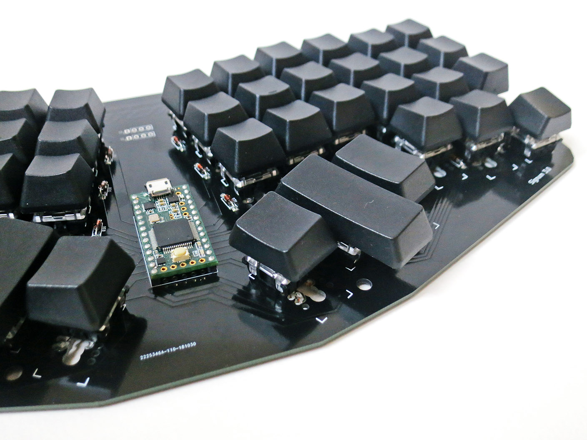

# Signum keyboard
My ergonomic keyboard based on [Troy Fletcher's](http://troyfletcher.net) board.

The keyboard uses [Teency USB development board](https://www.pjrc.com/teensy/).

The layouts of my keyboard are at [keyboard-layout-editor.com](http://www.keyboard-layout-editor.com/#/gists/1db4e9d50eaa5da4385a4fb53a21c67d).

## Development Setup
1. Install [Arduino IDE](//www.arduino.cc)
2. Install [Teensyduino add-on](https://www.pjrc.com/teensy/teensyduino.html) for Arduino IDE

Note: On Rock64 I used packages built for `arrch64` architecture.

## Resources
* [Signum 3 configuration](http://troyfletcher.net/config.html)
* [USB HID keyboard codes, see page 53](https://www.usb.org/sites/default/files/documents/hut1_12v2.pdf)
* [QMK Keycodes](https://docs.qmk.fm/#/keycodes)
* [Teensy keycodes](https://www.pjrc.com/teensy/td_keyboard.html)
* [Code example](https://gist.github.com/huytd/8dabf762a868b86d2aa597b878e53df0)
* [Teensy 3.1 bare metal: Writing a USB driver](http://kevincuzner.com/2014/12/12/teensy-3-1-bare-metal-writing-a-usb-driver/)
* [Debouncing](https://www.embedded.com/electronics-blogs/break-points/4024981/My-favorite-software-debouncers)
* [Debounce in C](https://github.com/tcleg/Button_Debouncer)
* [My collection of layouts](https://gist.github.com/DmitryMyadzelets/c22403c905512ba3f0da4bed3c205506)

## Teensy's pins used to scan the keys
```
Teensy    2.0   3.2

col 0     C6    11
col 1     D2    9
col 2     B7    6
col 3     D3    10
col 4     D0    7
col 5     F7    18
col 6     F5    20
col 7     B6    17
col 8     B5    16
col 9     B4    15
col 10    D1    8
col 11    D7    14

row 0     B0    2
row 1     B3    5
row 2     F6    19
row 3     C7    12
```
Note: I use Teency 3.2

## Indexes of the keys
```
 0  1  2  3  4  5    6  7  8  9 10 11
12 13 14 15 16 17   18 19 20 21 22 23
24 25 26 27 28 29   30 31 32 33 34 35
36 37 38 39 40 41   42 43 44 45 46 47
```

## Layouts
### My full keyboard
The 47 keys with symbols
```
` 1 2 3 4 5  6 7 8 9 0 - =
  Q W E R T  Y U I O P [ ]
  A S D F G  H J K L ; ' \
  Z X C V B  N M , . /
```
```
Ё 1 2 3 4 5   6 7 8 9 0 - =
  Й Ц У К Е   Н Г Ш Щ З Х Ъ 
  Ф Ы В А П   Р О Л Д Ж Э \
  Я Ч С М И   Т Ь Б Ю .
```
### My ergonomic keyboard
```
` Q W E R T  Y U I O P [
  A S D F G  H J K L ; '
  Z X C V B  N M , . / ]
                     \ 
```
```
Ё Й Ц У К Е  Н Г Ш Щ З Х
  Ф Ы В А П  Р О Л Д Ж Э
  Я Ч С М И  Т Ь Б Ю . Ъ
                     \ 
```
### Other keyboards
Atreus keboard, main layout:
```
Q W E R T      Y U I O P
A S D F G      H J K L ;
Z X C V B `  \ N M , . /
                   - '
```

Modifiers: `Ctrl, Shift, Alt, Win`

Press-only keys: `Esc, Tab, Enter, Caps`

## Observations
Printable symbols can't be delayed. Normally symbols appear when the keys go down. Some reduced keyboards make some symbols (e.g space) appear when a key goes up. When you type fast you can press keys in correct order, but release them in another order. E.g. when you type `a b` you may get `ab ` if the space symbol is delayed. However, some non-printable symbols, like Enter and Tab may have no such effect.

The most used non-symbol keys are Space and Backspace, according to
[this](https://www.businessinsider.com/these-are-the-three-most-popular-keys-on-a-keyboard-2013-7?IR=T)
and [this](https://daniel.haxx.se/blog/2014/11/12/keyboard-key-frequency/)
articles. These keys should be at default positions for thumbs. Another frequently used key is Shift. When it's pressed, the thumbs should remain at their default position.

